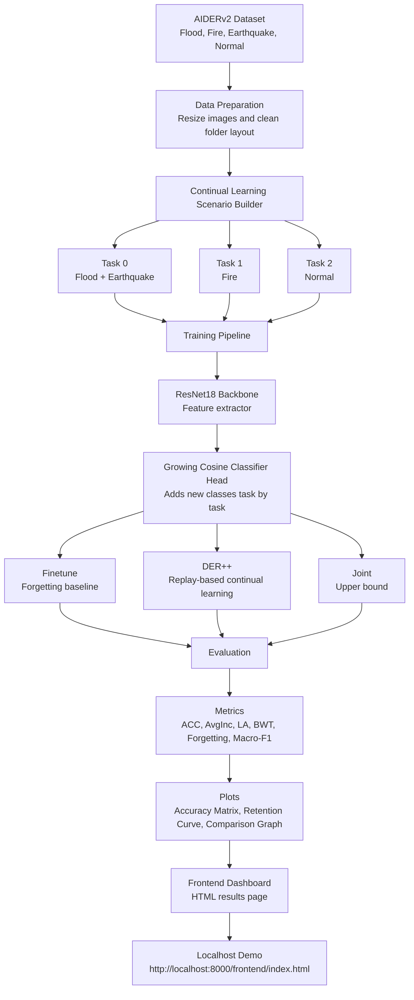

# Architecture

## Flow

The project first prepares the AIDERv2 disaster image dataset into a clean
train/validation/test layout. The scenario builder converts the dataset into a
continual learning stream, where the model learns disaster classes task by task.

The model uses a ResNet18 backbone to extract image features and a growing cosine
classifier head to add new classes as they appear. The benchmark compares normal
fine-tuning, DER++ replay-based continual learning, and joint training as an
upper bound.

After every task, the system evaluates how much old disaster knowledge is
retained. The final output is a metrics table, plots, and a dashboard that
summarizes accuracy and forgetting.
